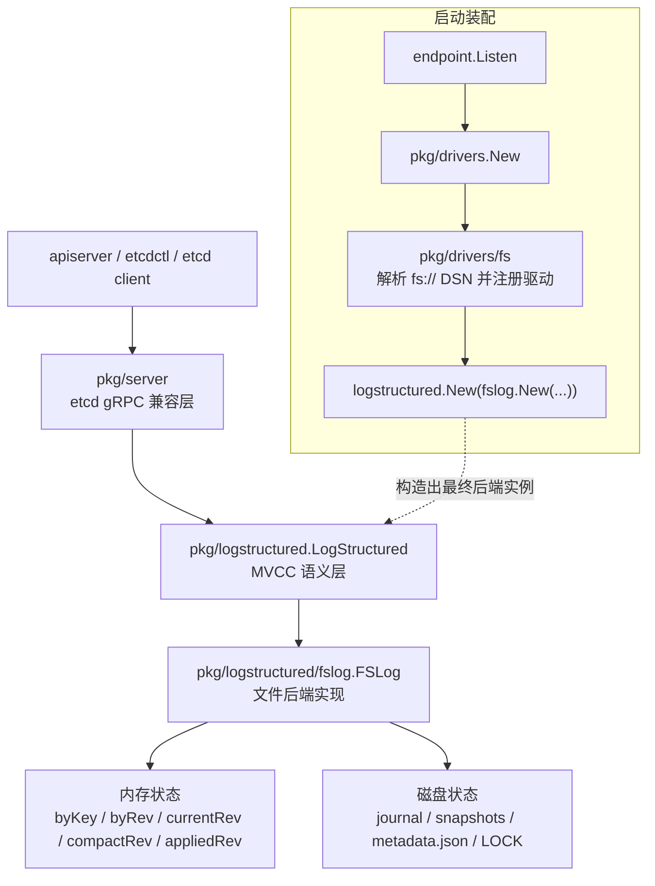

# 概览

## 状态

本文档描述的是**当前已经落地的 Kine 文件系统后端第一版实现**，而不再只是最初的概念设计。

它仍然是一个**单机、单写者、用于学习的后端**：

- 不实现分布式一致性
- 不支持多个 Kine 进程同时共享写入同一个数据目录
- 以正确支持 `revision`、`list`、`watch`、`snapshot`、`compact` 语义为目标
- 通过现有 Kine 的 etcd 兼容层对外工作

本方案最核心的设计选择保持不变：接入点放在 `logstructured.Log` 之下，而不是放在 SQL 专用的 `server.Dialect` 抽象之下。

## 为什么 `logstructured.Log` 是正确的接入点

Kine 的分层大致如下：

- `pkg/server`：对外暴露 etcd gRPC 接口
- `pkg/logstructured`：在一个追加式变更日志之上实现 etcd 风格的 MVCC 语义
- `pkg/logstructured/sqllog`：这个变更日志的 SQL 后端实现
- `pkg/drivers/*`：后端注册与装配层

对于文件系统后端来说，实现 `server.Dialect` 会非常别扭，因为这个接口和 `database/sql` 绑定得很紧，直接依赖 `*sql.Rows` 以及 SQL 事务等类型。这里的目标是接入 Kine 的“存储后端”，不是定义 apiserver 直接连接的 etcd 服务地址。

更合适的做法是：直接实现 `pkg/logstructured.Log`，然后像现有 SQL 驱动一样，用 `logstructured.New(...)` 把它包成最终后端。

简而言之：

- 保留现有的 gRPC 与 etcd 兼容层
- 保留 `logstructured.LogStructured`
- 用 `fslog.FSLog` 替代 `sqllog.SQLLog`

## 分层架构图

下面这张图同时展示了 **启动装配路径** 和 **运行时请求路径**。需要注意的是，`pkg/drivers/fs` 主要只参与启动装配；真正处理读写语义的是 `pkg/logstructured/fslog`。

## 当前已实现能力

当前实现已经具备以下能力：

- `fs://` 后端 DSN 解析与校验
- append-only journal 持久化
- 内存索引 `byKey` / `byRev`
- `List` / `Count` / `After`
- `Append` 驱动的 `Create` / `Update` / `Delete` 语义
- `Watch` 与 `WaitForSyncTo`
- 周期性 snapshot
- compaction 与旧 journal 清理
- 无 Docker 集成测试与完整 `scripts/test fs` 本地验证链路

另外，当前实现还显式保留了两处 Kine 兼容行为：

- **fresh store 启动基线兼容**：空存储首次启动时，会补一条内部 `compact_rev_key` 记录，占用 revision `1`，这样 `/registry/health` 会落在 revision `2`，与现有主要后端保持一致
- **TTL root list 兼容**：为了兼容 Kine 共享层对 `Log.List("/", ...)` 的历史用法，`fslog` 在根路径 TTL 初始化场景下保留了局部兼容逻辑，而没有去修改共享层调用方语义

## 目标

- 新增一个 `fs://...` 的存储后端 DSN scheme
- 保持 Kine 现有 API 在以下操作上的行为一致：
  - `Create`
  - `Update`
  - `Delete`
  - `Get`
  - `List`
  - `Count`
  - `Watch`
  - `Compact`
- 保持严格的全局单调递增 revision
- 支持从磁盘恢复重启后的状态
- 在单个 Kine 进程内保持 read-after-write 一致性
- 通过 Kine 现有测试路径完成本地验证

## 非目标

- 不实现 Raft 或多节点一致性
- 不保证多个 Kine 进程同时指向同一目录时的安全并发写入
- 不以极致吞吐优化为首要目标
- 不追求超出 Kine 当前支持子集之外的完整 etcd 特性兼容
- 当前不修改 `kine/scripts/test-load` 本身来适配本地虚拟环境
