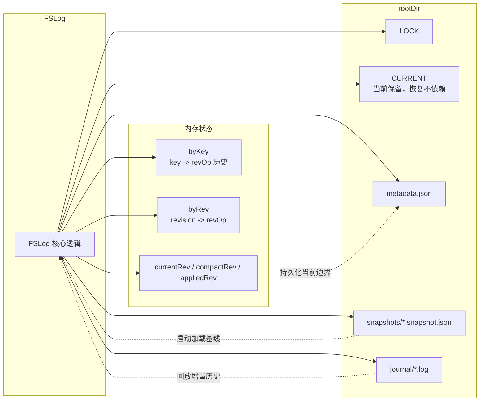

# 存储模型与数据组织

## 存储模型

文件系统后端**没有**采用简单的“一个 key 对应一个文件”的模型。

当前实现采用的是：

- 磁盘上的 append-only journal
- 供读取使用的内存有序索引
- 用于加快重启恢复速度的周期性 snapshot

这在语义角色上与 `sqllog` 是一致的，只是把 SQL 行换成了文件记录。

## 当前磁盘布局

当前数据目录结构如下：

```text
<root>/
  LOCK
  CURRENT
  metadata.json
  snapshots/
    00000000000000001000.snapshot.json
  journal/
    00000000000000000001.log
    00000000000000005001.log
```

## 存储架构图

下面这张图展示了 `FSLog` 在运行时如何同时维护内存状态和磁盘状态，以及启动恢复时如何从 snapshot 与 journal 重建索引。



## 各文件职责

- `LOCK`
  - 使用 advisory exclusive lock
  - 保证同一数据目录在同一时刻只有一个写者进程
- `CURRENT`
  - 当前仍保留路径定义，但第一版启动与恢复不依赖它
  - 恢复逻辑直接扫描 `snapshots/` 与 `journal/`
- `metadata.json`
  - 保存 `currentRevision`、`compactRevision`、`activeSegment`
- `snapshots/*.snapshot.json`
  - 保存某个 revision 时刻的压缩后基线状态
- `journal/*.log`
  - 保存按 revision 追加的 JSONL 记录

## 记录格式

journal 的单条记录当前为 `JournalRecord`：

- `revision`
- `key`
- `create`
- `delete`
- `createRevision`
- `prevRevision`
- `lease`
- `value`
- `prevValue`

其中 `value` / `prevValue` 当前直接以 JSON 中的字节数组形式写入，不额外增加 framed encoding 或 checksum。

## 内存索引

当前实现维护两类核心索引：

- `byKey`
  - key -> 该 key 的完整 `revOp` 历史切片
- `byRev`
  - revision -> 对应单个 `revOp`

同时维护：

- `currentRev`
- `compactRev`
- `appliedRev`

这些状态共同支撑：

- 当前视图读取
- 历史 revision 读取
- `After(revision)` 有序回放
- `Watch` 与 `WaitForSyncTo`
- compaction 后的基线重建

## 启动 revision 兼容

当前实现并不是从 revision `0` 直接开始用户可见写入，而是保持与其他 Kine 主要后端一致的 fresh store 行为：

- brand-new store 启动时，先写入内部 `compact_rev_key`，占用 revision `1`
- 随后 `logstructured.Start()` 创建 `/registry/health`，占用 revision `2`

这样可以保持上游 `apiserver` 测试对 startup resourceVersion 的历史预期。
