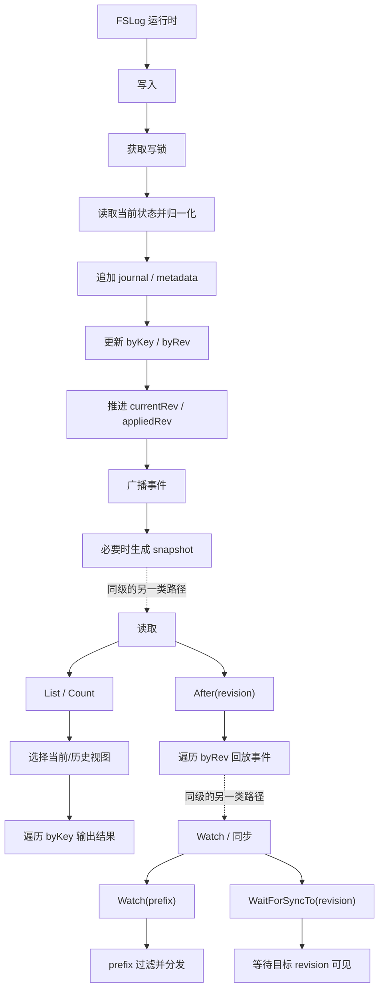

# 启动恢复、读写路径与 Watch

## 启动恢复路径

当前 `FSLog.Start(ctx)` 的主要流程为：

1. 校验 `rootDir`
2. 自动创建根目录、`journal/`、`snapshots/`
3. 打开 `LOCK` 并获取独占锁
4. 读取 `metadata.json`
5. 扫描 `snapshots/` 与 `journal/`
6. 加载最新 snapshot
7. 回放 snapshot 之后的 journal
8. 如为全新空目录，则补写 startup compatibility record
9. 设置 `currentRev`、`compactRev`、`appliedRev`
10. 注册基于 `ctx.Done()` 的资源清理

其中“startup compatibility record”当前指内部 `compact_rev_key`，用来让 fresh store 启动基线与现有 Kine 后端保持一致。

## 运行时架构图

下面这张图用于帮助阅读者快速区分三类运行时路径：写入路径、读取路径、以及 watch/同步路径。

## 写路径

当前写路径入口是 `Append(ctx, event)`：

1. 获取写锁
2. 读取 key 当前状态
3. 分配 `nextRev = currentRev + 1`
4. 将 `server.Event` 归一化为 `JournalRecord`
5. 追加写入当前 segment
6. 应用到内存索引
7. 落盘 `metadata.json`
8. 更新 `currentRev` 与 `appliedRev`
9. 发出 watch 事件并 `Broadcast`
10. 按 `snapshot_interval` 触发 snapshot

当前实现会在写前做必要的冲突检查：

- create 已存在时返回 `server.ErrKeyExists`
- update / delete 遇到错误的前序 revision 时返回 `ErrWriteConflict`

## 读路径

### `List`

当前 `List` 支持：

- 当前 revision 视图
- 指定历史 revision 视图
- 精确 key 与 prefix 模式
- `ErrFutureRev`
- `ErrCompacted`
- key 按字典序返回

同时，当前实现保留了一处**仅限 fslog 内部**的 root list 兼容：

- 当 Kine 的 TTL 初始化直接调用 `Log.List("/", ...)` 且 `limit > 1` 时
- `fslog` 会把它局部解释成 root prefix 扫描，并用 continue-token 语义翻页
- 这样可以兼容 Kine 历史共享层行为，而不去修改共享层代码

### `Count`

`Count` 复用与 `List` 相同的 revision 边界检查，并按当前/历史视图统计匹配 key 数量。

### `After`

`After` 按严格 revision 顺序遍历 `byRev`，返回指定 revision 之后的事件流，用于补历史与 watch 追平。

## Watch 与同步语义

当前 `Watch(ctx, prefix)` 基于内部 broadcaster：

- 首次订阅时由 `startWatch()` 暴露统一 `stream`
- 后续写入完成后通过 `emitEvents()` 广播
- prefix 过滤由 `filterWatchEvents()` 完成

当前 `WaitForSyncTo(revision)` 基于 `appliedRev + cond`：

- 写入完成后更新 `appliedRev`
- 然后 `Broadcast()` 唤醒等待方
- 上层可以在 watch/list 衔接处等待指定 revision 已经可见
