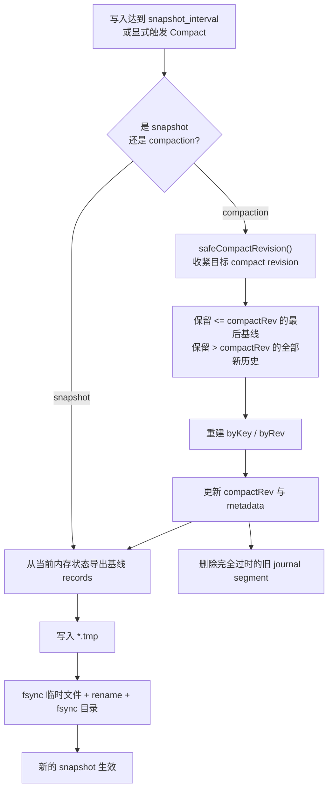

# Snapshot、Compaction 与维护语义

## Snapshot

当前 snapshot 机制已经实现，核心行为为：

- 按 `snapshot_interval` 触发
- 先写入 `*.tmp`
- `fsync` 临时文件
- 原子 `rename`
- `fsync` 目录
- 启动时加载最新 snapshot，再回放之后的 journal

snapshot 当前保存：

- `currentRevision`
- `compactRevision`
- 压缩后基线 `records`

## Compaction

当前 compaction 机制已经实现，核心规则为：

- 目标 compact revision 会先经过 `safeCompactRevision()` 收紧
- 至少保留 `compact_min_retain` 指定的窗口
- 对每个 key：
  - 保留 `rev <= compactRev` 的最后一个非删除基线
  - 保留全部 `rev > compactRev` 的新历史
- 完成后重建 `byKey` / `byRev`
- 更新 `compactRev`
- 触发新的 snapshot
- 删除已完全过时的旧 journal segment

## Snapshot / Compaction 维护图

下面这张图概括了维护路径里的两个关键动作：基于 revision 阈值生成 snapshot，以及在 compaction 后重建新的基线状态。

## 当前取舍

当前实现有意保持简单：

- 不做增量 snapshot
- 不做校验和或 framed journal
- 不做跨进程共享写目录
- compaction 以语义正确为优先，而不是以最小磁盘占用为优先

## 已知限制

- `pkg/testserver` 与 `logstructured` 的异步日志收尾 race 仍只记录为已知问题，未在本轮修复
- 本地 `test-load` 的虚拟环境复用通过外部执行约定完成，不修改 `kine/scripts/test-load`
- 当前设计目标依然是学习与单机验证，不是生产级存储引擎
