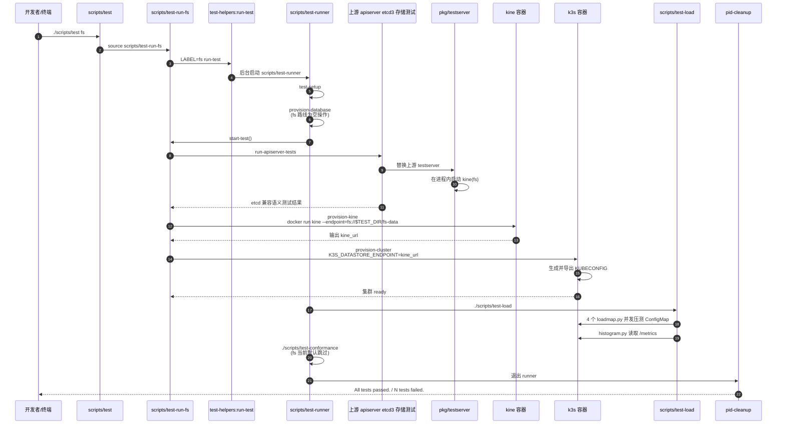

# `scripts/test-run-fs` 完整测试流程

本文档说明 `scripts/test-run-fs` 实际是如何工作的，以及它在整套 `scripts/test fs` 流程中到底测了什么。

需要先说明一点：`scripts/test-run-fs` 本身非常薄，它主要负责**把文件系统后端接入 Kine 现有测试框架**。真正的执行逻辑分散在以下几个位置：

- `scripts/test`
- `scripts/test-runner`
- `scripts/test-helpers`
- `pkg/testserver`
- `scripts/test-load`
- `scripts/test-conformance`

## 入口

本地通常通过下面的命令启动完整 fs 测试链路：

```bash
cd /home/what/myproject/etcd-mock/kine
make build package
PATH="/home/what/myproject/etcd-mock/.venv/bin:$PATH" ./scripts/test fs
```

其中：

- `make build package` 负责构建当前版本的 `kine` 二进制和测试镜像
- `./scripts/test fs` 负责调用 `scripts/test-run-fs`
- `PATH` 注入根目录 `.venv/bin`，是为了让 `scripts/test-load` 中的 `python3` 能找到已经安装好的 `kubernetes` 和 `termplotlib`

## `scripts/test fs` 如何进入 `test-run-fs`

`scripts/test` 会先加载 `scripts/test-helpers`，然后根据参数选择性加载某个 `test-run-*` 文件。

当参数是 `fs` 时：

- `scripts/test` 会 `source ./scripts/test-run-fs`
- `scripts/test-run-fs` 会定义 `start-test()`
- 文件最后执行 `LABEL=fs run-test`

这里有两个容易误解的点：

- `scripts/test-run-fs` 不是独立子进程，而是被 `source` 到当前 shell 里执行
- `Did test-run-fs 0` 只表示 `source` 文件本身没有报错，不表示完整测试已经通过

真正的成败由 `scripts/test-helpers` 中的 `pid-cleanup` 统一汇总，最后输出 `All tests passed.` 或失败统计。

## `test-run-fs` 自己做了什么

`scripts/test-run-fs` 的核心只有一个 `start-test()`：

```bash
start-test() {
    local fs_endpoint="fs://$TEST_DIR/fs-data"
    KINE_IMAGE=$IMAGE KINE_ENDPOINT="$fs_endpoint" run-apiserver-tests
    KINE_IMAGE=$IMAGE KINE_ENDPOINT="$fs_endpoint" provision-kine
    local kine_url=$(cat $TEST_DIR/kine/*/metadata/url)
    K3S_DATASTORE_ENDPOINT=$kine_url provision-cluster
}
```

它按顺序做三件事：

1. 用 `fs` 后端先跑一轮上游 `apiserver` 的 etcd3 存储测试
2. 启动一个真实的 `kine` 容器，后端仍然指向 `fs` DSN
3. 启动一个 `k3s` 容器，让它把 datastore 指向上面那个 `kine`

可以把它理解成：

- 第一段测 **etcd 兼容语义**
- 第二段和第三段测 **真实容器化链路**

## 简化时序图

下面这张 Mermaid 时序图把 `./scripts/test fs` 的主链路串起来了：



## 外层调度：`test-runner`

`scripts/test-runner` 是这套脚本化测试的总调度器。它会依次执行：

1. `test-setup`
2. `provision-database`
3. `start-test`
4. `./scripts/test-load`
5. `./scripts/test-conformance`

对 fs 后端来说，这几步的实际含义如下。

### 1. `test-setup`

`test-setup` 会创建一个临时测试目录 `TEST_DIR=/tmp/XXXXXX`，并注册统一的退出清理流程。

它还负责：

- 创建日志目录
- 把标准输出和标准错误同时写到控制台和 `$TEST_DIR/logs/test.log`
- 在失败时自动 dump 所有测试容器日志
- 删除测试过程中创建的容器
- 在 `TEST_CLEANUP=true` 时删除整个测试目录

因此，`TEST_DIR` 是整个测试流程的共享工作目录。后面所有临时数据、元信息、kubeconfig、日志都挂在这个目录下面。

### 2. `provision-database`

对 fs 后端来说，这一步实际上什么都不做。

原因是：

- `provision-database` 只有在 `DB_IMAGE` 和 `DB_PASSWORD_ENV` 被设置时才会启动数据库容器
- `test-run-fs` 没有设置这些变量
- 所以 fs 路线不像 MySQL/Postgres 那样依赖外部数据库容器

### 3. `start-test`

这是 `test-run-fs` 自己定义的主体，也是 fs 路线的核心。

下文会把它拆成三段详细说明。

### 4. `scripts/test-load`

在 `start-test()` 完成后，`test-runner` 会执行 `scripts/test-load`。

它会：

- 启动 4 个并发的 Python 进程执行 `hack/loadmap.py`
- 对当前 Kubernetes 集群中的 `ConfigMap` 做随机的创建、更新、删除、列举
- 再执行 `hack/histogram.py` 从 `/metrics` 中抓取 `etcd_request_duration_seconds`，打印一个简单的请求耗时分布

这一段更偏向：

- 真实集群集成验证
- 粗粒度压力回归
- 性能指标观察

它不是 Go 单元测试，也不是 `go test ./...` 的一部分。

### 5. `scripts/test-conformance`

`test-runner` 最后总会调用 `scripts/test-conformance`。

但当前脚本只对 `sqlite` 开 conformance，其他后端直接跳过。因此对 `fs` 来说，这一步通常只会输出：

```text
Skipping conformance
```

## `start-test()` 的三段实际测试

### 第一段：`run-apiserver-tests`

这是最重要的一段，因为它直接使用 Kubernetes `apiserver` 自己的 etcd3 存储测试来验证 Kine 的 etcd 兼容语义。

### 它怎么准备测试二进制

`run-apiserver-tests` 会检查 `bin/etcd3.test` 是否已经存在；如果不存在，就调用 `build-apiserver-tests`。

`build-apiserver-tests` 会：

1. 根据当前 Go module 中的 `k8s.io/apiserver` 版本，检出对应上游源码
2. 把上游测试里用到的 `k8s.io/apiserver/pkg/storage/etcd3/testserver` 替换成 `github.com/k3s-io/kine/pkg/testserver`
3. 修补一个 startup revision 的断言，让它从 `1` 改成 `2`
4. 修补 compact 测试中过短的等待超时
5. 把 `github.com/k3s-io/kine` replace 到当前工作树
6. 生成 `bin/etcd3.test`

因此，这里的核心思路是：

- **借用上游 Kubernetes 的 etcd3 存储测试**
- **但把底层 testserver 换成 Kine 自己的 testserver**

### 这里的 fs 后端是怎么接进去的

在调用 `run-apiserver-tests` 前，`test-run-fs` 先设置了：

```bash
KINE_ENDPOINT="fs://$TEST_DIR/fs-data"
```

而 `pkg/testserver` 内部会调用 `app.Config(nil)` 读取环境变量，因此会把这个 `KINE_ENDPOINT` 带到 Kine 的配置里。

随后 `pkg/testserver` 会：

- 根据测试目录生成一个唯一后端路径
- 在当前 Go 测试进程内调用 `endpoint.Listen(...)`
- 起一个真实的 Kine 服务端点
- 再用 etcd v3 client 去连这个端点

所以这一段测试的本质是：

- 测试进程内嵌启动一个 Kine
- Kine 的后端是 `fs`
- 上层执行的是 Kubernetes 自带的 etcd3 存储测试集

这一步主要覆盖：

- `Get` / `List` / `Count`
- `Put` / `Delete`
- `Txn` / revision 语义
- `Watch`
- `Compact`
- `Lease/TTL` 相关行为
- `resourceVersion` 相关边界

### 这一段不测什么

这一段还没有起真实的 `kine` Docker 容器，也没有起 `k3s`。

所以它测的是：

- **协议与存储语义兼容性**

而不是：

- 镜像打包
- 容器内启动参数
- `k3s -> kine` 的完整容器链路

### 第二段：`provision-kine`

`run-apiserver-tests` 通过后，`start-test()` 才会继续调 `provision-kine`。

### 它做了什么

`provision-kine` 会执行一个 `docker run`，启动当前构建出的 `kine` 镜像，并带上：

- `--compact-interval=0`
- `--watch-progress-notify-interval=5s`
- `--endpoint=$KINE_ENDPOINT`

对于 fs 路线来说，`KINE_ENDPOINT` 就是 `fs://$TEST_DIR/fs-data`。

随后它会把以下信息写入：

- `TEST_DIR/kine/<n>/metadata/ip`
- `TEST_DIR/kine/<n>/metadata/port`
- `TEST_DIR/kine/<n>/metadata/url`

后面 `test-run-fs` 会从 `metadata/url` 中读出 `kine_url`，提供给 `k3s`。

### 这里的 fs 数据实际放在哪

这一段没有额外挂 volume，所以 `fs` 后端数据实际上位于 **容器内部文件系统** 中。

也就是说：

- 测试期间存在
- 容器删除后一起消失

它的价值不是验证持久化目录复用，而是验证：

- 当前镜像是否能正确启动 fs backend
- `--endpoint=fs://...` 这条路径在容器里是否能正常工作

### 第三段：`provision-cluster`

最后，`test-run-fs` 会把上面拿到的 `kine_url` 填到：

```bash
K3S_DATASTORE_ENDPOINT=$kine_url
```

然后调用 `provision-cluster`。

### 它做了什么

`provision-cluster` 内部会启动一个 `k3s server` 容器，并传入：

- `-e K3S_DATASTORE_ENDPOINT=$K3S_DATASTORE_ENDPOINT`

这意味着：

- `k3s` 不再直连 sqlite/mysql/postgres/etcd
- 它改为把所有 Kubernetes 数据都存到上一步起好的 `kine`

启动之后，它还会：

1. 从 `k3s` 容器中拷出 `/etc/rancher/k3s/k3s.yaml`
2. 在 Linux 上把里面的 `https://127.0.0.1:6443` 改成容器真实地址
3. 写到 `$TEST_DIR/servers/1/kubeconfig.yaml`
4. `export KUBECONFIG=$TEST_DIR/servers/1/kubeconfig.yaml`
5. 等待 apiserver 真正 ready

所以从这一刻起，后面的 `test-load` 会自动连到这个临时起起来的 `k3s` 集群。

## `test-load` 到底在测什么

`scripts/test-load` 是对已经起好的 `k3s -> kine(fs)` 这条链做一轮真实 API 压测和指标采样。

### `hack/loadmap.py`

`loadmap.py` 使用 `KUBECONFIG` 连接当前集群，在 `load-test` namespace 里对 `ConfigMap` 做随机操作：

- 创建
- 更新
- 删除
- 列举

脚本会启动 4 个并发进程，每个进程默认执行 1000 轮随机操作。

这一段测到的是：

- kube-apiserver
- storage layer
- `k3s`
- `kine`
- `fs backend`

整条链在真实对象读写下是否还能稳定工作。

### `hack/histogram.py`

`histogram.py` 会访问当前集群的 `/metrics`，提取 `etcd_request_duration_seconds` 指标，并按操作类型输出一个简单直方图。

这一步更偏向观察：

- 当前 backend 的请求延迟分布
- 基本性能画像

它不直接决定语义是否正确，但能辅助判断后端在真实流量下有没有明显异常。

## 这条脚本化流程和 Go 测试的关系

`scripts/test-run-fs` **不会**顺手执行 `go test ./pkg/drivers/fs`。

因此要把两类测试区分开：

### 1. Go 测试

例如：

- `pkg/logstructured/fslog/*_test.go`
- `pkg/drivers/fs/integration_test.go`

这类测试的特点是：

- 由 `go test` 驱动
- 更适合精确复现单个语义问题
- 调试粒度更细

### 2. 脚本化测试

也就是：

```bash
./scripts/test fs
```

它的特点是：

- 会起 Docker 容器
- 会跑上游 `apiserver` 的 etcd3 存储测试
- 会起真实 `kine` 和 `k3s`
- 会跑 `test-load`

更像是一条：

- 端到端集成验证链路

## 可以把它理解成三层验证

如果把 `scripts/test-run-fs` 放进整体视角，可以把它理解成三层：

1. **语义兼容层**
   - `run-apiserver-tests`
   - 验证 fs backend 对 etcd/Kubernetes 存储语义的兼容性
2. **容器链路层**
   - `provision-kine` + `provision-cluster`
   - 验证镜像、启动参数、`k3s -> kine` 连接链是否正常
3. **真实对象流量层**
   - `scripts/test-load`
   - 验证真实 Kubernetes API 对象流量下的稳定性和基本性能

## 当前结论

因此，`scripts/test-run-fs` 不是“只跑了一个脚本”，而是把以下几类测试串成了一条链：

- 上游 `apiserver` 的 etcd3 存储测试
- 真实 `kine` 容器启动测试
- `k3s` 接入 `kine(fs)` 的集成测试
- `ConfigMap` 随机负载与 metrics 采样

对当前文件系统后端来说，这已经是一条相对完整的本地端到端验证路径。
